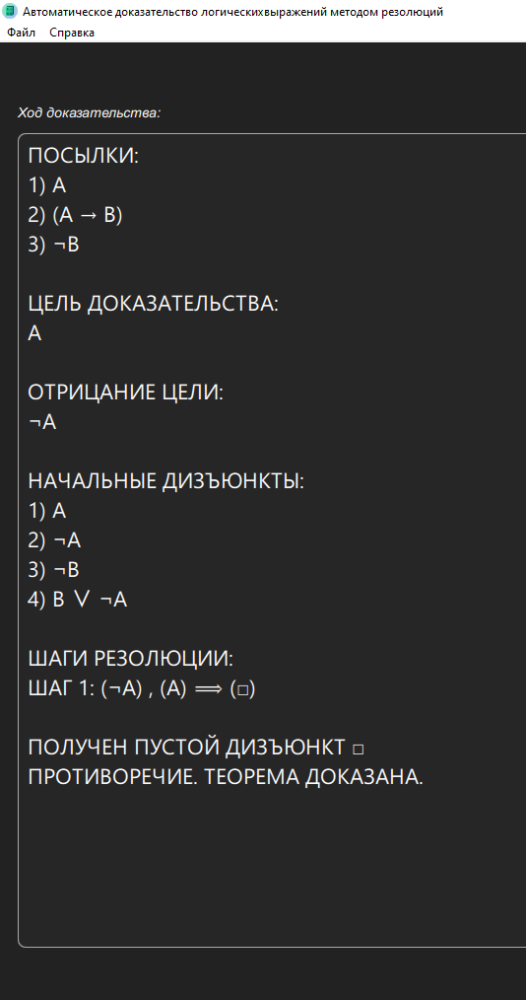

# calqlatr
Приложение для автоматического доказательства логических выражений методом резолюций.
© 2026

По состоянию на июль 2026 все работоспособно, кроме пошагового исполнения доказательства, а также нет реалзации пунктов меню, кроме "О программе",
также пока не написан help-файл, хотя интерфейс интутивно понятен, в нем можно быстро разобраться.
Визуальный интерфейс реализован на фреймворке QT6 и qml, backend-обработка организована на python3.
На странице Releases размещен архив с исполняемым кодом (пререлиз, так как есть указанные выше
недоработки, но основа - автоматическое доказательство работает). В архив включены все необходимые библиотеки
и сам интерпретатор python, на случай, если он не установлен на целевой машине. Библиотеки включены
в архив потому, что сборка производилась с помощью QT с динамической линковкой, при желании из
исходников можете сами осуществть сборку со статической линковкой.

Пример результирующего скриншота из приложения:

